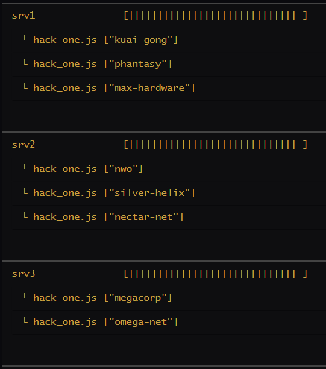
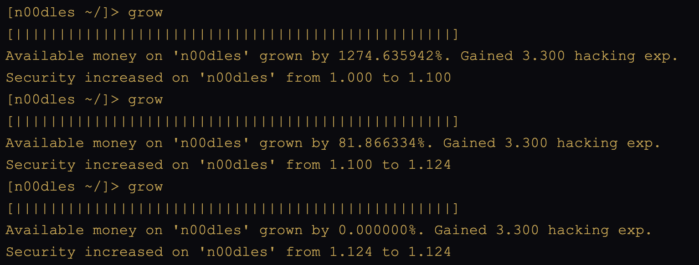

# Bitburner Hacking



---

## How to Use

To start hacking:
```
run hack_start.js
```

To stop hacking:

```
run hack_stop.js
```

As money and hacking skill initially accumulate, acquire the TOR, and [use it](https://bitburner.readthedocs.io/en/latest/basicgameplay/terminal.html?highlight=TOR#buy) to purchase port-opening programs. You can re-run `hack_start.js` whenever you acquire new servers, acquire new augmentations, or gain any enhancements that would allow you to hack more servers. Re-running `hack_start.js` does not require running `hack_stop.js` first.

## Hacking Mechanics

Servers have a few important properties:
- A **name** that uniquely identifies the server
- A server **hacking level**, which means that it cannot be hacked by the player unless the player's own hacking level meets or exceeds the server hacking level.
- **Port Threshold**, which means that unless the player opens at least this number of ports on the server, it cannot be hacked.
- A **security level**, which dictates the probability that a hack attempt will be successful.
- **RAM**, which provide resources to run scripts on the server.
- **Money**, which the player would like to acquire from the server via hacking it.

A server cannot be compromised until it is [nuked](https://bitburner.readthedocs.io/en/latest/netscript/basicfunctions/nuke.html?highlight=nuke). A server cannot be nuked until the player has opened enough ports on the server and has a sufficiently high hacking level. Port-opening scripts can be created by the player with a sufficiently high hacking level, or purchased with the TOR.

Once nuked, a player can attack the server by running 3 primary attack scripts:
- [`grow()`](https://bitburner.readthedocs.io/en/latest/netscript/basicfunctions/grow.html)
- [`weaken()`](https://bitburner.readthedocs.io/en/latest/netscript/basicfunctions/weaken.html)
- [`hack()`](https://bitburner.readthedocs.io/en/latest/netscript/basicfunctions/hack.html)

Each of these has consequences, which is summarized in the table below:

|Attack|Security Level|Server Money|Player Money|Guaranteed to Succeed|Hacking Experience|
|---|---|---|---|---|---|
|grow|&uarr;|&uarr;|-|Yes|&uarr;|
|weaken|&darr;|-|-|Yes|&uarr;|
|hack|&uarr;|&darr;|&uarr;|No|&uarr;|

One aspect to these commands is that they present diminishing returns. For example, here's the output for calling `grow` 3 times in a row on the server `n00dles` on the start of a new game:



As you can see, the first grow raised the money on the server by about 1,274%, the second grow about 82% more, and the third grow was useless other than providing hacking experience. This behavior is the same for the other two commands as well, which guides the strategy that follows.

## Hacking Strategy

### Target Discovery

The hacking routine starts by discovering which servers can be hacked by comparing the player's hacking level to the server's hacking level and by comparing the number of port-opening scripts owned by the player relative to the server's port threshold. The script `open_target.js` is attempted on each server, which performs these checks. It attempts to open as many ports as possible and nuke the target server in preparation for hacking.

### Load Balancing Across Servers

The main strategy is a load-balancing technique to first distribute hacking responsibilities to the player's home and purchased servers. 

From there, the primary hacking script is called on each target for the targets each friendly server is responsible for. The required hacking level is used as a weight.

As an example, the server `silver-helix` has a hacking level of 150, the server `iron-gym` has a hacking level of `100`, and the server `neo-net` has a hacking level of `50`. With `home` and one purchased server, `home` would be responsible for targeting `silver-helix`, and the purchased server would target both `iron-gym` and `neo-net` (each having equal weights of 150).

### Load Balancing Within Servers

RAM allows the player to amplify the effects of a script by assigning it multiple [threads](https://bitburner.readthedocs.io/en/latest/basicgameplay/scripts.html?highlight=threads#multithreading-scripts).

Furthermore, `home` server would allocate all of its threads to the single attack of `silver-helix`, while the server would allocate two-thirds (100/(100+50)) of its threads to the `iron-gym` server attack and the remaining one-third (50/(100+50)) of its threads to the `neo-net` attack.

This is the essence of the ways the attacks are distributed; the targets themselves are distributed based on hacking level, and then the thread counts are allocated within each server, also based on hacking level.

### Single Target

When targeting a single server, the general strategy is to grow the server "close to" its maximum possible wealth, weaken it "close to" its minimum security level, and then attempt to hack the server until the hack succeeds, thereby transferring funds from the target server to the player. This process is repeated in an endless loop.

I've quoted "close to" because due to the diminishing returns effect, it usually isn't worth the effort to try to get the servers to their maximum levels. I've set the goal to be within 80% of the maximum amount of money a server can have and within 20% of the minimum security level. This is usually a good enough situation to justify a hack attempt (i.e. enough cash on the server worth taking, and a low enough security level to make the hack likely to be successful.)

### Target Self-Weaking

Finally, it makes sense to have no resource go unused. I've covered the resources owned by the player (`home` and purchased servers), but what about the RAM on the target servers themselves? Once they are nuked, the player can run scripts on these as well, and this extra RAM ought to be put to good use.

For this, the server's resources are used in an endless loop to weaken itself. The idea here is that the weakening scripts have no downside, since they reduce the security level while always providing hacking experience. Any other script that potentially increases the security level could interfere with the security level balances achieved via the single-target scripts described above.

## Script Table

In order to run the hacking scheme, `run hack_start.js` is all that is required to kick that off. However, there are other scripts in play behind the scenes when that happens. Here is a summary of the working parts.

| File | Description |
| ---- | ----------- |
| `hack_start.js` | The primary hacking script which needs to be invoked directly. It effectively acts as a load balancer, equally allocating targets across friendly servers, using the server hacking level as a weight. It distributes (`grow`, `weaken`, `hack`) workloads across `home` and any purchased friendly servers, and also distributes self-weakening attacks on target servers after opening them. |
| `hack_all.js`| This distributes the workload __within__ a server by calling `hack_one.js` on all of its targets, allocating the number of threads to be proportional to the target hacking levels. |
| `hack_one.js` | This runs an endless grow-weaken-hack loop on the target using the strategy described above, which runs each command repeatedly until target metrics are achieved. |
| `hack_stop.js` | This kills all hacking scripts on `home` and purchased servers. |
| `open_target.js` | Prepares a target to be vulnerable to hacking. This is done by first opening as many ports as possible on the target server, depending on the player's available port-opening scripts and player hacking level relative to the hacking level of the server. Then, if possible, the server is nuked, and the following two self-weaking scripts are copied over to the server. Finally, `run_self_weaken.js` is executed to start the process of using the server's own resources against itself.
| `run_self_weaken.js` | Calculate the maximum number of threads allowed to run `self_weaken.js` based on the host's free memory, and then invokes `self_weaken.js` using that number of threads. |
| `self_weaken.js` | An endless loop of a call to `weaken`, using the target's own hostname so that it continually weakens itself. |