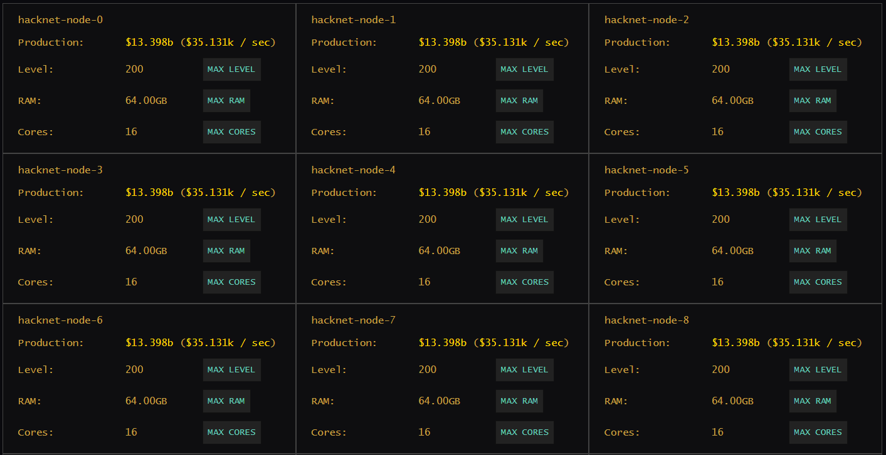

# Bitburner Hacknet Nodes



---

## How to Use

Upgrade all of your existing hacknet nodes to the desired level, RAM, and cores, e.g.:
```
run hacknet_upgrade.js 200 64 16
```

## Summary

[Hacknet nodes](https://bitburner.readthedocs.io/en/latest/guidesandtips/gettingstartedguideforbeginnerprogrammers.html?highlight=hacknet#hacknet-nodes) are a way for the player to effortlessly earn income over time just by owning them. It's useful in the beginning of the game when money is low, but their usefulness quickly tapers off as the player advances. For reference, a fully upgraded hacknet-node (with some hacknet augmentations) generates about $3b per day. This is low, considering that hacking scripts generate on the order of tens or hundreds of trillions of dollars per day.

Hacknet nodes reset after acquiring augmentations. This means that at some point, purchasing hacknet nodes is wasteful because there won't be enough time for them to generate enough money to pay for their own cost, let alone generate a profit.

## Strategy

The number of nodes to acquire depends on how long one expects to go until the next augmentation installation; a rule of thumb could be to stop buying them after `hacknet-node-26`, where a subsequent hacknet node would cost $8.2b.

## Script

Hacknet nodes have 3 properties that can be upgraded:
- Level
- RAM
- Cores

The script `hacknet_upgrade.js` will attempt to upgrade to the desired level(s) of these properties, in that order, for all owned hacknet nodes. This is a conveinence over clicking multiple times in the UI to achieve the same result.