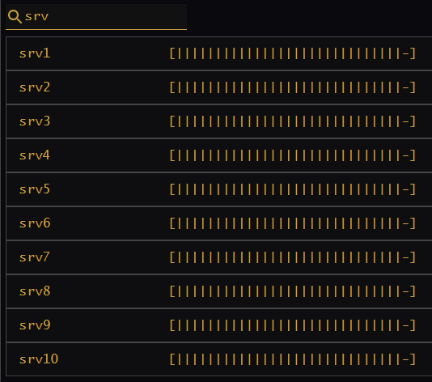

# Bitburner Servers



---

## How to Use

Purchase a new server with maximum RAM capacity, up to the game's hard-coded limit of 25:
```
run buy_max_servers.js
```

The server will automatically be named with the prefix `srv` followed by its number (1-indexed).

## Servers
In addition to the `home` computer, the player can (and must, to advance quickly) purchase servers that essentially act as additional `home` computers for running code. A subtle difference servers have with home computers is that they can't acquire core upgrades, and they don't persist between augmentations. However, they are usually much cheaper to acquire than home computer upgrades.

I name my purchased servers as `srv1`, `srv2`, ... , `srv25`. I usually don't buy a server unless it's maxed out because it's a hassle and extra expense to delete and repurchase servers. For reference, a maximum sized server has 2^20 GB (1.05 PB) of RAM and costs $57,671,680,000 (~$58b).

## Script Summary
The script `buy_max_server.js` attempts to purchase a maximum-sized server if the player has sufficient funds. Once acquired, re-running the primary hacking script `hack_start.js` will automatically use the newly purchased server(s) to update the attack rollout.