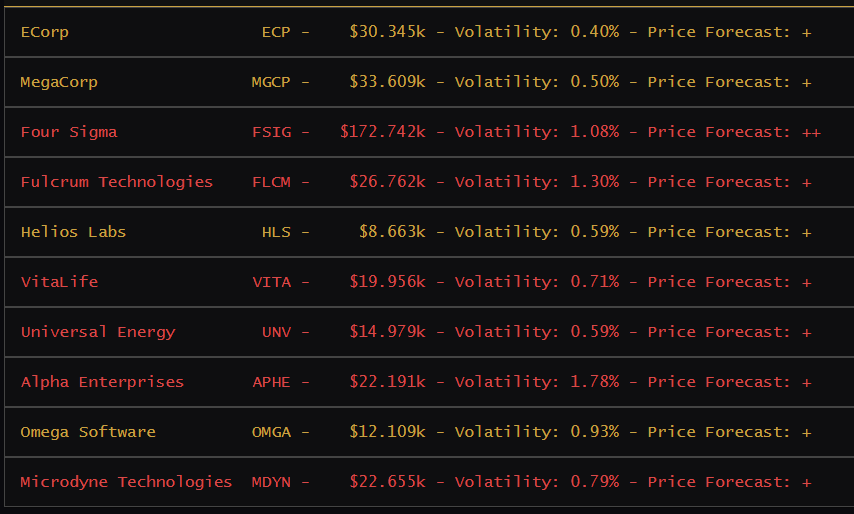

# Bitburner Stocks



---

## How to Use

First, purchase a WSE account, access to the TIX API, and access to the 4S Market Data Feed. Then, the following will allocate 1 thread per stock to automatically watch for and carry out buy/sell opportunities on all stocks.

```
run stock_hold_all.js
```

This doesn't rely on the ability to short stocks, which isn't available to the player until much later in the game. Also, this strategy will unlock the "Wolf of Wall Street" achievement (make $1q on the stock market).

## Stock Mechanics

There are 33 stocks in the game from which the player can buy and sell, and there is a maximum number of shares a player can purchase, which varies per stock. At each moment, every stock has an associated probability that its value will increase in the next stock update. This probability is revealed with the 4S Market Data Feed purchase. Per the documentation, stock prices are updated approximately [every 6 seconds](https://bitburner.readthedocs.io/en/latest/basicgameplay/stockmarket.html?highlight=stocks#under-the-hood).

Stock sales cost a flat-rate commission of $100k, which is usually negligible compared to the profit of trading.

## Strategy 

As mentioned earlier, the player will first need to purchase:

- A **WSE account**, which allows the player to engage in buying and selling stock in the first place 
- The **TIX API**, which allows the player to write commands to engage in buying and selling stock programmatically.
- The **4S Market Data Feed**, which allows the player to request stock forecasts through an API; it also gives a visual indicator using +/- forecast signs in the UI.

To watch a single stock, the probability of that stock increasing is checked every 6 seconds. If the probability is 55% or higher that it will increase, then the stock will be purchased at the maximum amount possible. If the probability that the stock will increase falls below 51%, then the stock will be sold, even at a loss. These thresholds are configurable in `stock_hold_one.js`. 

I found that the two thresholds are necessary because sometimes the probabilities fluctuate after purchasing, and the stock would be sold if, say, the probability temporarily decreases to 54% after purchase. Having two thresholds protects against this thrashing effect, which can cause the player to lose money on trades.

To watch all stocks, the script `stock_hold_all.js` allocates a thread to each of the 33 stocks. This watches each stock on its own merits and uses the strategy outlined above to purchase as many shares as the player can if the stock has a sufficiently favorable outlook and to sell all shares and/or avoid purchasing otherwise.

## Script Table

| File | Description |
| ---- | ----------- |
| `stock_hold_all.js` | The primary stock script which needs to be invoked directly. It calls `stock_hold_one.js` on each of the 33 stock listings in the game. |
| `stock_hold_one.js` | Given a ticker symbol as an argument, it executes the buy/hold/sell strategy described above for that company. |
| `stock_stop.js` | This terminates all stock programs; it does not sell currently held stock prior to terminating, so the player will be left holding any purchased stock. |